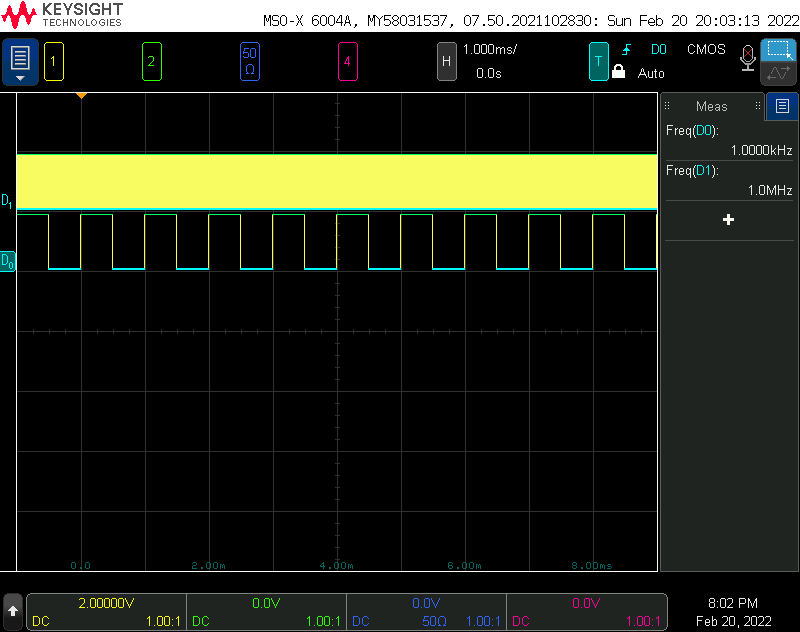

# fdPIC - frequency divider PIC

This is another implementation of the picDIV idea (http://www.leapsecond.com/pic/picdiv.htm). The original picDIV project is written in Microchip MPASM assembler (MPASM) which is not supported anymore. I first planned to port its source code to MPLAB XC8 PIC Assembler but then I decided to implement it on my way. 

# How it works ?

picDIV is a cool idea. Although PIC is a microcontroller, because it is very simple, it is very easy to calculate the amount of time it takes for instructions to be executed. The frequency input is used as the clock input (CLKIN) of PIC. Each instruction cycle of PIC takes 4 clock cycles. Almost all instructions run in 1 clock cycle, only the instructions modifying PC (goto, decfsz) takes 2 clock cycles. By using proper number of instructions, it is possible to toggle a GPIO output of PIC at exactly predefined cycles. So if the output is toggled every 125 instruction cycles, this is going to be a frequency divider, with the output frequency = fCLKIN / 1000.

# How to find the values for constants (COUNTER_1, COUNTER_2, COUNTER_3): search.py

The picDIV project has different source files for common frequency division ratios, whereas fdPIC has a single (assembly) source file (fdPIC.S) where you can change 3 constants to set the integer frequency division ratio. A simple python code (search.py) is provided to find the constant values for the frequency division ratio you want. The code is written to support most of the ratios that are multiples of 5 but not every ratio is supported.

For example, the constants for ratio=1000 can be found like this:

```
$ python search.py 1000
searching for: 1000
     1000 => a=  1, b=  1, c=196
     1000 => a=  2, b=  1, c= 97
     1000 => a=  2, b=  2, c= 48
     1000 => a=  2, b=  7, c= 13
     1000 => a=  2, b= 14, c=  6
     1000 => a=  2, b= 49, c=  1
     1000 => a=  3, b=  1, c= 64
     1000 => a=  3, b=  5, c= 12
     1000 => a=  3, b= 13, c=  4
     1000 => a=  6, b=  1, c= 31
     1000 => a=  6, b=  2, c= 15
     1000 => a=  6, b=  4, c=  7
     1000 => a=  6, b=  8, c=  3
     1000 => a=  6, b= 16, c=  1
     1000 => a=  9, b=  1, c= 20
     1000 => a=  9, b=  3, c=  6
     1000 => a=  9, b=  7, c=  2
     1000 => a= 11, b=  1, c= 16
     1000 => a= 18, b=  1, c=  9
     1000 => a= 18, b=  2, c=  4
     1000 => a= 18, b=  5, c=  1
     1000 => a= 22, b=  1, c=  7
     1000 => a= 22, b=  2, c=  3
     1000 => a= 22, b=  4, c=  1
     1000 => a= 33, b=  1, c=  4
     1000 => a= 66, b=  1, c=  1
```

Below is from the scope, fdPIC is running with ratio=1000, input is 1MHz, output is 1KHz.



# Compile

The fdPIC.S is compiled in MPLAB X IDE using MPLAB XC8 PIC Assembler (pic-as) toolchain.

# Hardware

I am testing and using the project with PIC12F629. I guess it can easily be modified and run on other mid-range PICs. I do not know about the other PIC families, so I cannot say how easy it would be to use the code.

The input goes to GP5/CLKIN pin. MCLR is enabled, so it has to be pulled up to Vdd (10K resistor). I use the ICSP pins (GP0 and GP1) solely for ICSP, so nothing is connected to them. The output is GP2. GP4 is not used. All GPIO is set as outputs and driven to low at initialization but this does not affect ICSP pins or CLKIN. CLKIN is configured in configuration bits.
